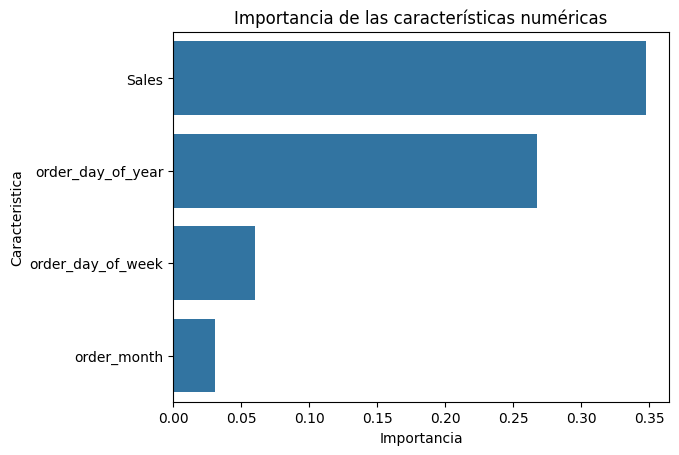

# 📦 Predicción de Retrasos en Suministros: Solución de Inteligencia Logística

## 📋 Resumen del Proyecto
Este proyecto desarrolla un modelo de Machine Learning capaz de predecir con antelación si un envío se retrasará, permitiendo a las empresas de logística (enfocado en el sector de Toluca) tomar decisiones proactivas para mejorar la satisfacción del cliente y reducir costos operativos.

Lo que hace especial a este proyecto es el **rigor analítico**: el modelo fue depurado a través de tres iteraciones para eliminar el *Data Leakage* (fuga de datos), garantizando que las predicciones sean honestas y aplicables al mundo real.

---

## 🎯 El Problema de Negocio
En el dataset analizado (DataCo Supply Chain), se detectó que el **54.83% de los envíos sufren retrasos**. Para una empresa logística, esto representa:
*   Pérdida de confianza del cliente.
*   Costos adicionales en gestión de reclamos.
*   Ineficiencia en la asignación de transporte.

**Objetivo:** Construir un sistema de alerta temprana que identifique pedidos en riesgo de retraso en el momento en que se realizan.

---

## 🛠️ Herramientas Utilizadas
*   **Lenguaje:** Python 3.x
*   **Bibliotecas:** Pandas, NumPy, Scikit-Learn, Matplotlib, Seaborn.
*   **Metodología:** Pipelines de preprocesamiento, validación cruzada y análisis de importancia de variables.

---

## 🚀 Proceso y Aprendizajes Clave

### 1. Limpieza Ética y Técnica
*   Se eliminó Información Personal Identificable (PII) para cumplir con estándares de privacidad.
*   Se descartaron columnas con más del 80% de valores nulos (como `Product Description` y `Order Zipcode`).

### 2. El Desafío del Data Leakage (Fuga de Datos) 🚩
Esta fue la parte más crítica del proyecto. Inicialmente, el modelo obtenía una precisión del 98%, lo cual era "demasiado bueno para ser verdad". 
*   **Detección:** Identificamos que variables como `Days for shipping (real)` y `Order Status` estaban entregando la respuesta al modelo antes de tiempo.
*   **Solución:** Se rediseñó el conjunto de datos tres veces hasta obtener un **modelo honesto** basado únicamente en información disponible al momento del pedido.

### 3. Feature Engineering
Se crearon nuevas variables para capturar patrones temporales:
*   `order_month` (Mes del pedido)
*   `order_day_of_week` (Día de la semana)
*   Esto permitió al modelo entender la estacionalidad de los retrasos.

---

## 📊 Resultados y Evaluación

Se compararon dos modelos principales:
1.  **Regresión Logística (Baseline):** Útil para entender la tendencia, pero con bajo recall.
2.  **RandomForestClassifier (Ganador):** Elegido por su capacidad de manejar relaciones no lineales y su balance superior entre precisión y sensibilidad.

| Métrica | Resultado |
| :--- | :--- |
| **F1-Score (Clase 1 Retrasado)** | **0.74** |
| **Precision** | **0.75** |
| **Recall** | **0.72** |

---

## 🧠 Interpretabilidad: ¿Por qué ocurren los retrasos?

Gracias al análisis de `feature_importances_`, descubrimos los verdaderos impulsores de los retrasos:
1.  **Sales (Ventas):** El valor monetario de la orden es el predictor más fuerte.
2.  **Patrones Temporales:** El día de la semana y el mes impactan significativamente en la probabilidad de demora.

---

## 👩‍💻 Autora
**Talia González**
*Científica de Datos en Formación | Especialista en Análisis de Decisiones Logísticas.*
